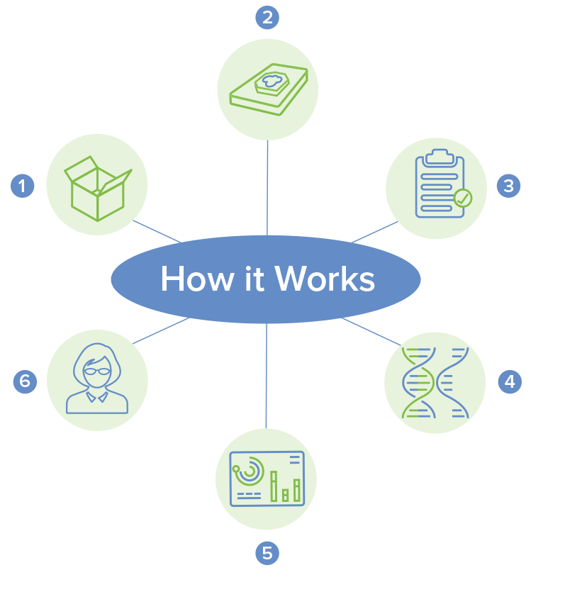

# Open Notes

# Next Focus (4 Qtrs)
- [ ] HealthCare - Really need to build the base of my technical and development chops
- [ ] Health - I perform better when I feel better. Going to test out fasting for the month of december and check back in in January. I will also not be drinking liquor by will be rewarding myself with wine from time to time. 

- [ ] Lock in Portfolio for 2021. I'm still making changes and will NEED to stop adding positions. I need to add a rule for adding a new position before adding to an existing or selling a current position. 

* Learning Options in June. [Link](https://www.youtube.com/watch?v=7PM4rNDr4oI)

# The Empire
Collection of research that goes along with companies that I own. 

## DRNA - Dicerna Pharmaceuticals

<figure>
    
</figure>
Dicerna Pharmaceuticals is developing drug candidates based on RNA interference, which is also called RNAi. RNAi is the most proven tool for controlling gene expression.

DNA and RNA are the root causes of disease. This is the pain point Dicerna is targeting.
but proteins are actually the drivers of disease. So the goal for genetic medicines is to reduce protein levels by affecting DNA and RNA expression. Up until now, we’ve had very limited tools available for targeting DNA and RNA directly. 

The goal of all genetic medicines is to control gene expression. If you can control gene expression, you can control protein levels, which are the drivers of disease.

There are three main ways of doing this: We can turn down gene expression, so we reduce protein levels that way. Sometimes you want to turn up gene expression to increase the levels of a protein. And we can also turn off or turn on gene expression. Technically we can’t completely turn off gene expression, it tends to just be another form of gene silencing, so turning it down,  but we can turn on gene expression in a tissue-specific manner.

Targeting a broad range of diseaes
Dicerna Development pipeline [LINK](https://dicerna.com/pipeline/):

<figure>
    
</figure>

- (rare) diseases hyperoxaluria
- alcohol use disorder - alcoholism
- A1AT liver disease
- (Mass market opportunity) chronic hepatitis B

the company has four clinical-stage assets. By the end of this year(2021), that’s going to reach six clinical-stage assets. And by the end of 2022, that will reach at least eight clinical-stage assets.It should add 2, 3, 4 clinical-stage assets each year for the foreseeable future. 

methodical commercial strategy -  has lead to industry-leading technology platfrom that's among the best-positioned in genetic medicines. 

There’s things in development where– RNAi goes and chews up the mRNA so that the protein is ever created

## RNA - Ribonucleic Acid  Research

RNA - carries out instructions: it copies the DNA to make proteins
Ribose -> type of sugar
Nucleic Acid -> type of biomolecule

single stranded base pairs: Adenine, Uracil, Guanine, Cytosine |  AU + CG

> DNA makes RNA makes proteins, single stranded

## Personalis $PSNL

?> WIP - Currently researching PSNL technology https://www.personalis.com/technology/

Personalis is a global leader in advanced genomics for cancer. Personalis provides advanced genomic sequencing and data analytic solutions for comprehensive molecular data analysis for patient-specific cancers. 

> Immuno-oncology (immune system + the study of cancer) - the study and development of treaments that take advantage of the body's immune system. 

> biopsy - examination of tissue removed from a living body to discover the presence, cause or extent of a disease. 

Products

ImmunoID NeXT - universal cancer immunogenomics platfrom
NeXT Dx Test - a comprehensive genomic testing solution
Next-Gen Sequencing Research Solutions
NeXT Liquid Biopsy

As of Jun.21.2021 Personalis has a 7 year runway of cash. They have yet to turn a profit and broght in 78.7M in 2020 revenue. 

### Growth Oppourtunties 

 <h3>NeXT Platform</h3> 

* Patented ACE (Accuracy and Content Enhanced) Technology is the foundation of the Personalis® NeXT Platform. ACE improves processes from nucleic acid preparation, to sequencing, to analytics for superior sequencing results.

> Liquid biopsies are tests that allow physicians to look for cancer cells from tumors in samples of blood from patients. They provide several advantages over tissue biopsies, including helping detect cancer faster and improving health outcomes.

<figure>
    
</figure>

<i>information pulled directly from personalis.com</i>

1. Arrival: The moment samples arrive at our CAP-accredited, CLIA-certified laboratory, the samples are given a unique sample ID and are tracked in LIMS and Symphony.

1. Sample sparing preparation: Our laboratory staff bring a wealth of operational expertise, allowing us to hone our sample sparing methods.

1. Quality Review: Prior to sequencing, samples undergo robust QC assessment.Sequencing: The NeXT assays run simultaneously to streamline processes and save time.

1. Analysis: Sequencing data is then run through our framework of analytical pipelines and tools to provide a wealth of precision oncology-related biomarker information for each individual patient sample

1. FAS Support: Every aspect of every project is overseen and managed by a designated PhD-level Project Manager. In addition, upon data delivery, your dedicated Field Applications Scientist will walk through the comprehensive dataset, and is available to answer any technical or commercial questions, and to follow-up with our internal scientific teams as needed.

 <h3>Partnership With MapKure </h3>

MapKure is looking to partner with Personalis to utilize the NeXT Platform - which enables broad tumor immunogenoic profiling of the tumor and consolidates multiple biomarker assays into one, providing a multidimensional view of the tumor and its tumor microenvironment from a single sample, which will help MapKure understand if other biomarkers are clinically relevant. 

> "Our NeXT Platform provides biotechnology companies, like MapKure, with comprehensive genomic information from the entire exome and transcriptome, and provides information that can support the identification of new, advanced biomarkers. Once these biomarkers have been selected by MapKure, we expect to develop them as a companion diagnostic for regulatory submission and approval. We look forward to working with MapKure to accelerate the development of their cancer therapy in the clinic by utilizing the results from our NeXT Platform." - John West, CEO at Personalis

Investor Presentation [here](https://investors.personalis.com/static-files/402e4d71-5bb6-4427-8ad4-ffe10b1191a2)

## Outset Medical $OM

