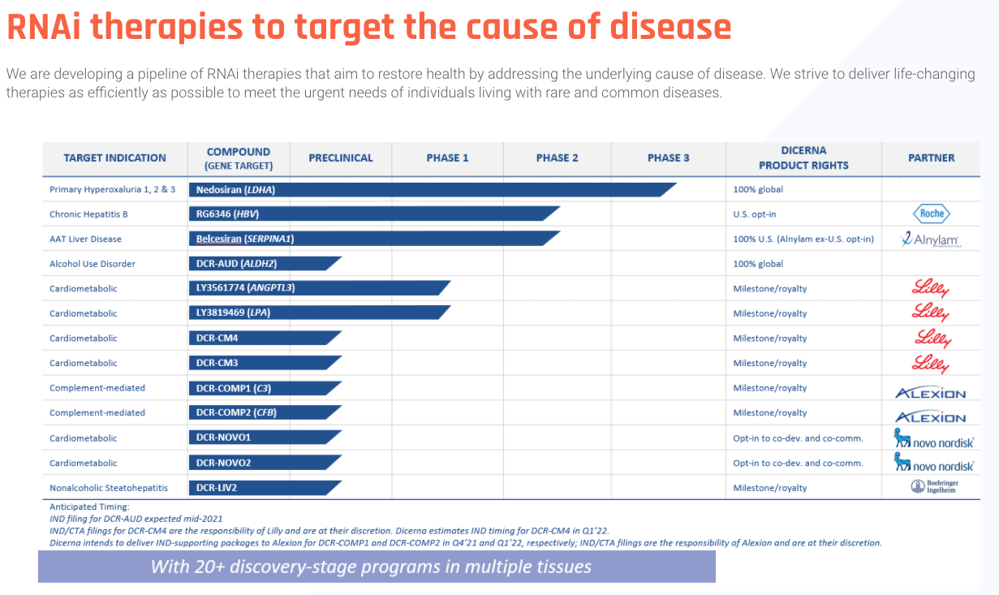

# Open Notes

# Next Focus
- [ ] HealthCare - Really need to build the base of my technical and development chops
- [ ] Health - I perform better when I feel better. Going to test out fasting for the month of december and check back in in January. I will also not be drinking liquor by will be rewarding myself with wine from time to time. 

- [ ] Lock in Portfolio for 2021. I'm still making changes and will NEED to stop adding positions. I need to add a rule for adding a new position before adding to an existing or selling a current position. 

* Learning Options in June. [Link](https://www.youtube.com/watch?v=7PM4rNDr4oI)

# The Empire
Collection of research that goes along with companies that I own. 

## DRNA - Dicerna Pharmaceuticals

<figure>
    
</figure>
Dicerna Pharmaceuticals is developing drug candidates based on RNA interference, which is also called RNAi. RNAi is the most proven tool for controlling gene expression.

DNA and RNA are the root causes of disease. This is the pain point Dicerna is targeting.
but proteins are actually the drivers of disease. So the goal for genetic medicines is to reduce protein levels by affecting DNA and RNA expression. Up until now, we’ve had very limited tools available for targeting DNA and RNA directly. 

The goal of all genetic medicines is to control gene expression. If you can control gene expression, you can control protein levels, which are the drivers of disease.

There are three main ways of doing this: We can turn down gene expression, so we reduce protein levels that way. Sometimes you want to turn up gene expression to increase the levels of a protein. And we can also turn off or turn on gene expression. Technically we can’t completely turn off gene expression, it tends to just be another form of gene silencing, so turning it down,  but we can turn on gene expression in a tissue-specific manner.

Targeting a broad range of diseaes
Dicerna Development pipeline [LINK](https://dicerna.com/pipeline/):

<figure>
    
</figure>

- (rare) diseases hyperoxaluria
- alcohol use disorder - alcoholism
- A1AT liver disease
- (Mass market opportunity) chronic hepatitis B

the company has four clinical-stage assets. By the end of this year(2021), that’s going to reach six clinical-stage assets. And by the end of 2022, that will reach at least eight clinical-stage assets.It should add 2, 3, 4 clinical-stage assets each year for the foreseeable future. 

methodical commercial strategy -  has lead to industry-leading technology platfrom that's among the best-positioned in genetic medicines. 

There’s things in development where– RNAi goes and chews up the mRNA so that the protein is ever created

## RNA - Ribonucleic Acid  Research

RNA - carries out instructions: it copies the DNA to make proteins
Ribose -> type of sugar
Nucleic Acid -> type of biomolecule

single stranded base pairs: Adenine, Uracil, Guanine, Cytosine |  AU + CG

> DNA makes RNA makes proteins, single stranded

## Personalis $PSNL

?> WIP - Currently researching PSNL technology https://www.personalis.com/technology/

Personalis is a global leader in advanced genomics for cancer. Personalis provides advanced genomic sequencing and data analytic solutions for comprehensive molecular data analysis for patient-specific cancers. 

> Immuno-oncology (immune system + the study of cancer) - the study and development of treaments that take advantage of the body's immune system. 

> biopsy - examination of tissue removed from a living body to discover the presence, cause or extent of a disease. 

Products

ImmunoID NeXT - universal cancer immunogenomics platfrom
NeXT Dx Test - a comprehensive genomic testing solution
Next-Gen Sequencing Research Solutions
NeXT Liquid Biopsy

As of Jun.21.2021 Personalis has a 7 year runway of cash. They have yet to turn a profit and broght in 78.7M in 2020 revenue. 

### Growth Oppourtunties 

 <h3>NeXT Platform</h3> 

* Patented ACE (Accuracy and Content Enhanced) Technology is the foundation of the Personalis® NeXT Platform. ACE improves processes from nucleic acid preparation, to sequencing, to analytics for superior sequencing results.

> Liquid biopsies are tests that allow physicians to look for cancer cells from tumors in samples of blood from patients. They provide several advantages over tissue biopsies, including helping detect cancer faster and improving health outcomes.

<figure>
    
</figure>

<i>information pulled directly from personalis.com</i>

1. Arrival: The moment samples arrive at our CAP-accredited, CLIA-certified laboratory, the samples are given a unique sample ID and are tracked in LIMS and Symphony.

1. Sample sparing preparation: Our laboratory staff bring a wealth of operational expertise, allowing us to hone our sample sparing methods.

1. Quality Review: Prior to sequencing, samples undergo robust QC assessment.Sequencing: The NeXT assays run simultaneously to streamline processes and save time.

1. Analysis: Sequencing data is then run through our framework of analytical pipelines and tools to provide a wealth of precision oncology-related biomarker information for each individual patient sample

1. FAS Support: Every aspect of every project is overseen and managed by a designated PhD-level Project Manager. In addition, upon data delivery, your dedicated Field Applications Scientist will walk through the comprehensive dataset, and is available to answer any technical or commercial questions, and to follow-up with our internal scientific teams as needed.

 <h3>Partnership With MapKure </h3>

MapKure is looking to partner with Personalis to utilize the NeXT Platform - which enables broad tumor immunogenoic profiling of the tumor and consolidates multiple biomarker assays into one, providing a multidimensional view of the tumor and its tumor microenvironment from a single sample, which will help MapKure understand if other biomarkers are clinically relevant. 

> "Our NeXT Platform provides biotechnology companies, like MapKure, with comprehensive genomic information from the entire exome and transcriptome, and provides information that can support the identification of new, advanced biomarkers. Once these biomarkers have been selected by MapKure, we expect to develop them as a companion diagnostic for regulatory submission and approval. We look forward to working with MapKure to accelerate the development of their cancer therapy in the clinic by utilizing the results from our NeXT Platform." - John West, CEO at Personalis

Investor Presentation [here](https://investors.personalis.com/static-files/402e4d71-5bb6-4427-8ad4-ffe10b1191a2)

## Outset Medical $OM (High Conviction)

Outset has a first-of-ts kind technology to reduce the cost and complexity of dialysis from the hospital to the home. Dialysis is one of the largest, most expensive, least-changed sectors of healthcare.This company has produced a first of its kind technology to reduce cost and complexity of dialysis! Outset believes their Tablo device has significant technological advancement to transform dialysis care in acute and home settings. OM’s strategy is to use their hardware platform (Tablo) with software to drive continuous upgrades and improvements.

Outset already has FDA approval for use of their Tablo device. But to continue to build a high growth business OM is focusing on the following:

- Penetrate acute care market by new customer acquisition and current customer expansion
- Expand within home dialysis market 
- Leverage the emergence of transitional care units 
- Maintain and widen their technology leadership position
- Expand Gross margins. 

According to Outset Medical Prospectus: “Our technology is designed to elevate the dialysis experience for patients, and help providers overcome traditional care delivery challenges. (...) We have generated meaningful evidence to demonstrate that providers can realize significant operational efficiencies, including reducing the cost of their dialysis programs by up to 80% in the intensive care unit (ICU).”

### What is Tablo?

Tablo is Outset’s enterprise solution for dialysis which is FDA-cleared. Tablo is designed to reduce the cost and complexity of dialysis across all care settings. Tablo only requires an electrical outlet and tap water to operate, freeing operators from the previous burdensome infrastructure requires to operate conventional dialysis machines. Tablo integrated functionality enables providers to standardize to a single platform that can be used across a wide spectrum of care settings. 

The Tablo system was confirmed safe and effective for home use in a 2019, prospective, multicenter, home hemodialysis trial with 30 patients. The results were published in November 2019 in Hemodialysis International. -https://onlinelibrary.wiley.com/doi/full/10.1111/hdi.12795

Tablo’s touch screen & OS:

- Touchscreen + interface combines sensor-based automation designed to enhance the patent experience 
- Sensor-based automation accelerate the training process, reduction treatment setup time, and streamlining the treatment process at home. 

Other functionality:

- only needs an electrical outlet and tap water connection to automatically produce dialysate required for dialysis. 
- wireless cloud connection to monitor data.
- Great for home usage

Additional Features:

- Automatic, regular updates that help Tablo get smarter over time
- Flexible treatment duration — from 30 minutes to 24 hours with no supply changeover
- Automated self clean;  
- Integrated blood pressure cuff
- Automated saline bolus and tracking
- One-touch rinseback
- Compatible with high-flux dialyzers

Partners and Customers 
- US Department of Health and Human Services awarded a contract for use of Tablo in communities hit by natural disasters
- AWS provides Tablo’s tech stack to the cloud

R&D Spending

Tablo has limited product and brand recognition. it is expected that the company’s sale and marketing, research and development, regulatory and other expenses will continue to increase due to market expanding efforts to increase adoption of Tablo. They are expected to continue with future product enhancements to Tablo, and conduction clinical trials on Tablo

“It’s essentially a small-scale, efficient, water purification technology that would allow the use of tap water in dialysis as opposed to gallons and gallons of pre-purified water, expanding capabilities in developing countries,” said Brian Wall, associate vice president of research, innovation and economic impact at Oregon State.
https://twitter.com/EngineerTree5/status/1360703687845380104?s=20

8/5/21 Earnings update

- Recorded net revenue of $25.2 million in the second quarter of 2021, a 115% increase compared to $11.7 million in the second quarter of 2020
- Achieved gross margin of 4.2% in the second quarter of 2021 compared to (40.6%) in the second quarter of 2020
- Appointed former Amazon AWS Health AI executive Jean-Olivier Racine as Chief Technology Officer
- Appointed Edwards Life Sciences Corporate VP Katie Szyman to the Board of Directors
- Announced several multi-year sales agreements with innovative dialysis care providers to drive home hemodialysis adoption with Tablo
- Nabeel Ahmed as our new permanent Chief Financial Officer.

Data analytics - With the new CTO, Jean-Olivier - Coming from Amazon where he headed engineering and science for AWS health AI. Jean-Olivier was brought on to help power the vision Outset has and continue to improve their already industry-leading features:

- sends patient treatment data seamlessly to electronic medical record systems as well as to Tablo hub
-  real time compliance-friendly automated record-keeping for customers
- captures performance data points, which is then used to fuel data analytics that drive R&D pipeline and make Tablo smarter over time through wireless software updates.

The system sends patient treatment data seamlessly to electronic medical record systems as well as to Tablo hub, our proprietary cloud-based provider portal that aggregates both treatment information and uniquely all Tablo fleet maintenance information, which enables real time compliance-friendly automated record-keeping for customers. At the same time, Tablo captures more than 500,000 machine performance data points during every treatment, which is then used to fuel data analytics and machine learning algorithms that drive our R&D pipeline and make Tablo smarter over time through wireless software updates.

 I think we can all imagine a very robust and much more comprehensive data set that would allow payers, health systems providers to monitor the wellness of their patients in a much more robust way. So we're looking at a bunch of ideas in that way. And then generally, how do you make dialysis prescription and management more personalized and more customized to the individual today, dialysis prescription is more of a one-size-fits-all. And we'd like to move to a one-size-fits-one model in the future.

- Tablo has the unique capability, we're the only system in the market to be able to do remote patient monitoring. That feature is enabled in the acute setting, which became incredibly important during some of the heights of COVID so that nurses and physicians could monitor multiple patients with COVID on Tablo in multiple rooms at the same time without having to go in and out and consume PPE.

****While these features are already industry-leading, we are just getting started. And to power our vision, we welcomed JO Racine, who prior to Outset headed engineering and science for Amazon web services health AI. JO brings an incredible knowledge of the development of high-scale and high-availability services for the storage of health data, which will be critical to the innovation we intend to pursue to further empower patients and health care providers. His background in designing scalable and performant cloud architectures for at-home health and consumer products such as Amazon Halo and Fire TV and in using machine learning for retrieving health insights from data will be invaluable to our ambitious plans for the future.

KEY SENTENCES AND PHRASES 
our team continued to build on our momentum, delivering another quarter of significant revenue outperformance, continued gross margin improvement and an outlook for the remainder of 2021 that leads us to raise our fiscal year 2021 revenue guidance.

New order placements on the acute side continue to be driven by health systems recognizing Tablo's economic value and ease of use, in addition to their interest in in-sourcing their inpatient dialysis program to take that control over patient quality, compliance and cost, which has never been more important than in today's environment.

Our success in adding new customers and an expanding within existing customers resulted in more new site installs in the second quarter than in any other quarter in the company's history. On the home front, new home console bookings grew more than 90% sequentially, primarily attributed to multiyear sales agreements with providers seeking to materially expand their home hemodialysis programs with Tablo

GOING SLOW AND STEADY
We talked consistently about 2021 being a go slow to go fast year of getting everything right first to ensure an exceptional patient and caregiver experience in the home before more rapidly scaling. I'm very pleased to report that our efforts against this goal remain on track. To measure our progress, we closely monitor leading indicators of patient experience that down the road may yield measurable and clinical, economic -- measurable clinical and economic benefit. For example, we look at treatment adherence. How often are patients completing their prescribed number of treatments per week? Thus far, the adherence rate for patients prescribed 3 times a week treatment on Tablo at home is 99%, which is important because the published literature demonstrates that when patients mis-prescribe treatment, their hospitalization risk is higher.

*****In addition to driving 115% year-over-year growth this past quarter, we also strengthened our team in some important areas, most notably, data analytics and machine learning. As the only hemodialysis system on the market with FDA clearance for 2-way wireless data transmission, Tablo is a powerful data engine, both before, during and after treatment in the hospital, in the home and everywhere in between. 