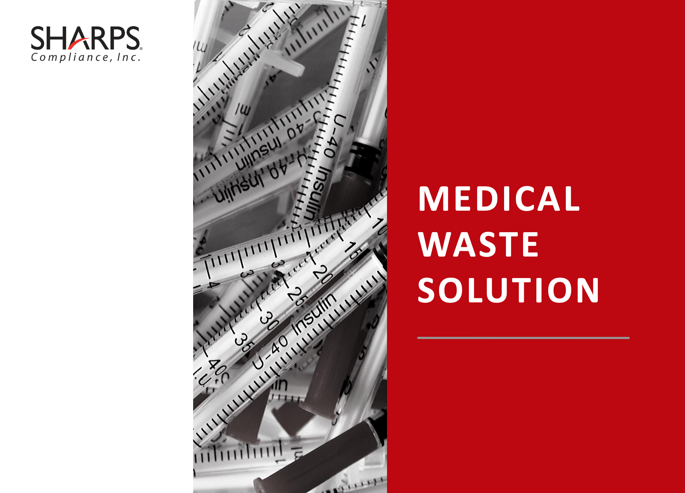
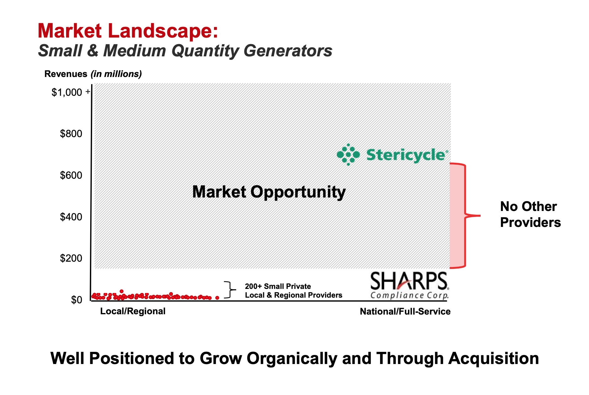
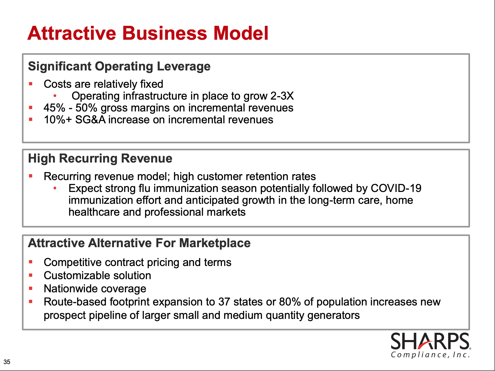
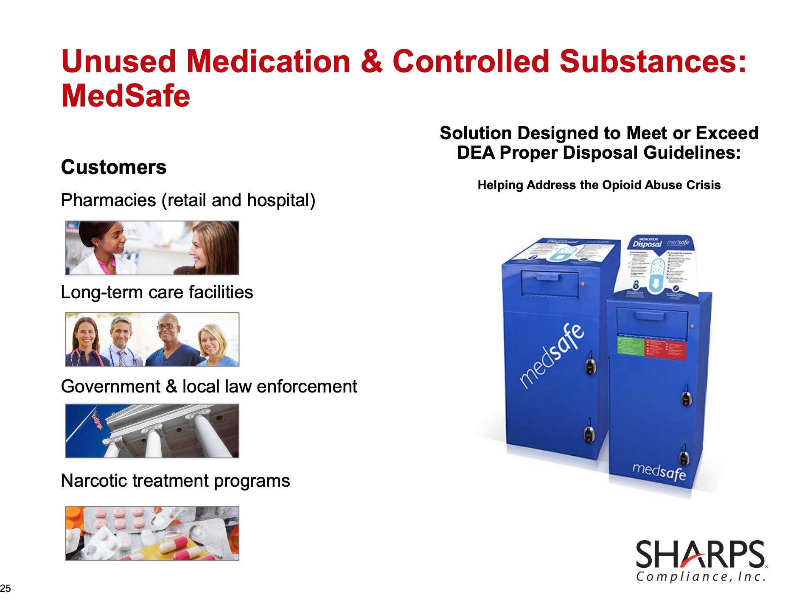
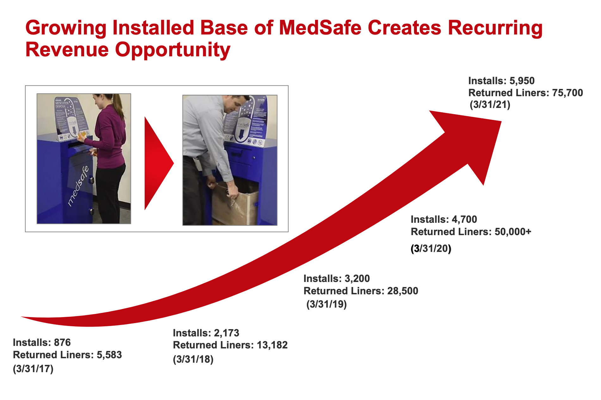
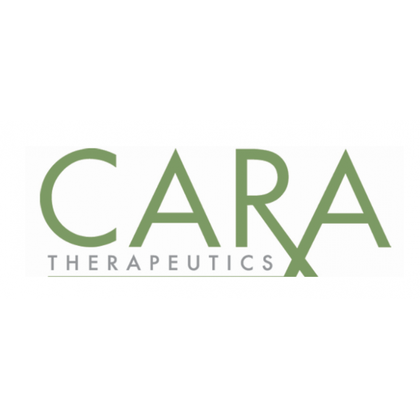
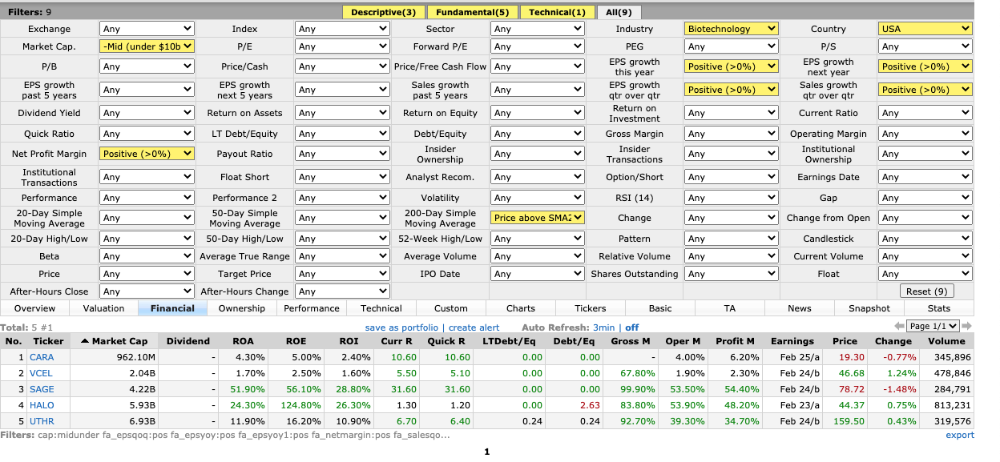
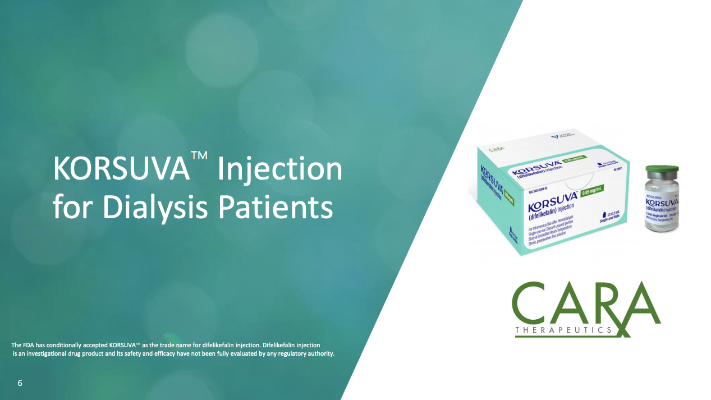
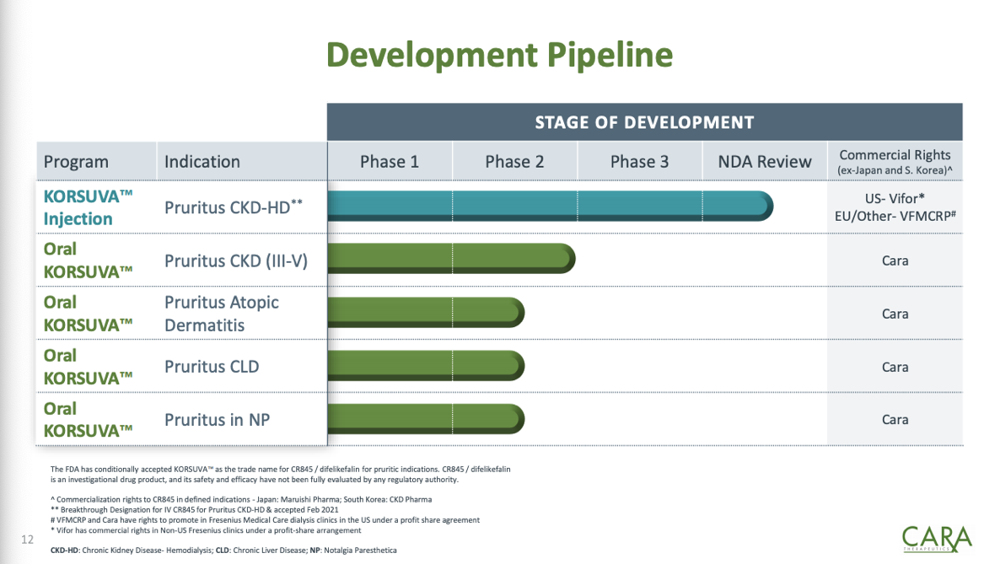
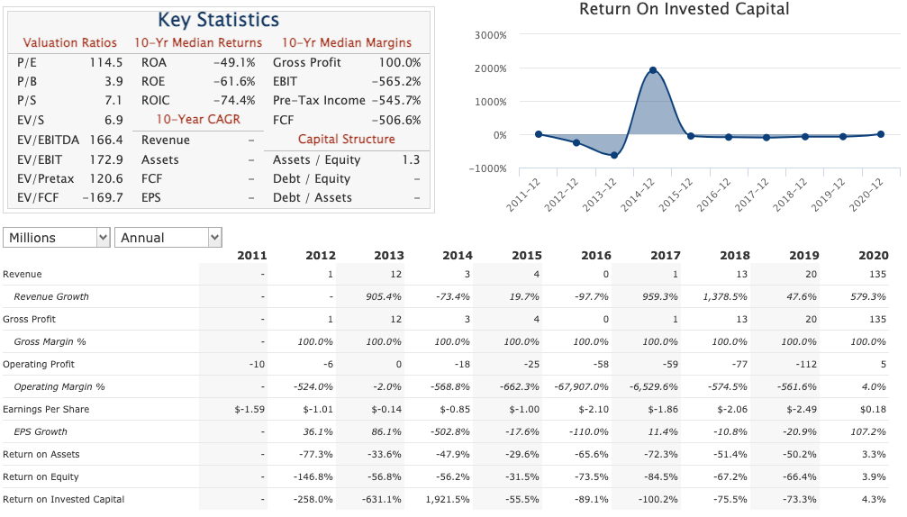

# Pocket Change

# Buys

## 05/17/2021 - $SMED - Sharps Compliance Corp. 

<figure>
    
</figure>

Sharps Compliance provides medial, pharmaceutical, and hazardous waste management services. Their services range from hazardous drug spill for chemotherapy to disposal & transportation of medical products like needles, syringes, and other used healthcare products. 

<figure>
    
</figure>

SMED is a leader (small) in medical waste solutions, currently serving a 2B market. Market consistent of two pillars - `Medical waste from small to medium size generators` & `unused medications`. Obviously there is a C19 play here but that is not something I'd focus on. I see opportunity in this company to start working with clinical trials, sports medicine facilities, and further expand their current market reach, which they are well positioned to do. 

<figure>
    
</figure>

Professional Market

The professional market consist of dental, veterinarian, physicians, labs, urgent care, surgery centers, dialysis centers, and funeral homes. there is a `~700M market opportunity` within the professional market

Long-Term Care Market

Long-Term Care Market seems to be untapped. Only serving 3 franchises (customers) at the moment which leaves for a `~85M market opportunity`. Not to mention the again population. 

Retail Pharmacy Market

SMED currently serves 69% of retail immunizing pharmacies! CVS, RiteAid, and RediClinic

Unused Medications Market Opportunity

<figure>
    
</figure>

SMED unused medication revenue increased from `1.3M in 2014 to 9.2M in 2020`. that is 9x in 6 years! This is estimated to be a `~1B market opportunity` with a lot of growth with the opioid epidemic coming to a head. The way Sharp Compliance collects medications & unused drugs is by using these special trash bin stations that individuals can dump their unused medications into. These are currently in pharmacies, LTC facilities, narcotic treatment programs, and with law enforcement stations. This gives SMED a recurring revenue opportunity! They also have an option for users to mail-in unused medication if they cannot go to a pharmacy or other drop-off location.  

<figure>
    
</figure>

> Valuation as of 5/17

|VALUATION | XXX |
|-----------|---|
|market cap|262.9M |
|**ROE**| 30.8% |
|ROI| 7.20% |
|ROA| 16.80% |
|Sales Q\Q | 164.40 |
|**EPS** Q\Q | 516.60 |
|**Profit Margin** | 14.20% |
| Oper. Margin | 15.70% |
| **Gross Margin** | 38.20% |
| **P/S** | 3.74 |
| P/E | 27.2 |

## 04/13/2021 - $MKTY

MTI Instruments, long known as the creators of industry leading aircraft engine maintenance diagnostic systems. Is engaged in the design, manufacture, and sale of test and measurement instruments and systems. They are also in the cryptocurrency mining business powered by renewable energy. eco-datacenters are on the plans as well but nothing has broke ground yet. 

MTI has been around since 

Their key market drivers are `PBS` which focuses on Freight, Military, Test Cell, and commercial. The other Drive is `instruments` which focus on 5G Deployment, semiconductors, Material Manufacturing. 

For their aero space tools for vibration diagnostics. This helps identify vibration sources and onboard spectral analysis find potential problems before they occur, helps identify concerns before they become safety risks in-flight situations. With unique tachometer signal conditioning circuitry, speed signals from all engine types, as well as tachometer generators, add a higher level of diagnostics for users of MTI instruments. 

New vertical solutions coming for 2021 and beyond! EV battery manufacturing, Industrial material manufacturing, semiconductors. 

 LINKS 

[PBS-4100+](https://mtiinstruments.com/applications/portable-vibration-balancing-system-simplifies-jet-engine-testing/) - Good description of what the use case for some of MTI's instruments would be used for. 

## 03/29/2021 - $JYNT

## 04/09 - XPEL

## 03/12/2021 - $CARA 

<figure>
    
</figure>

Earlier in the week I was procrastinating and found myself on finviz.com looking for stock opportunities. When on finviz.com I usually start a filter that targets high revenue growth QoQ and YoY. However, I've been researching more companies in the healthcare space as of late so I started with that. Ok, Healthcare companies and... profit! I'm trying to find companies in the healthcare space that are turning a profit. Surprise! There are not many companies in the healthcare space doing this, making a profit. There are even fewer small-cap healthcare companies turning a profit, the type of companies I like to invest in (10x potential). With the help of finviz I spotted this small-cap that was turning a profit, `$CARA`. Now to understand what the company is doing to make a profit.

<figure>
    
</figure>

First stop, investor presentation. The company summary: Cara therapeutics focuses on developing and commercializing chemical entities with a primary focus on `pruritus` and pain by  targeting kappa opioid receptors.

<figure>
    
</figure>

Their number one product right now is the `KORSUVA` injection which is currently under NDA Review and slated to be cleared in the 2nd half of 2021 (no date given). `KORSUVA` is non-addictive does away with all the side-effects of opioids and may replace the industry standard. Because this drug is currently under NDA review and is slated to be commercialized by 2022, `$CARA` looks like it is ready to take off. Not only that there are 3 other legs (oral drugs) in the development pipeline.

<figure>
    
</figure>

This `$CARA` reminds me of a similar company I'm currently invested in, `$ORMP`, which is treating a similar problem within the diabetes space. I'm unfamiliar with the true TAM of the diabetic market but I know it is one of the largest contributors to healthcare costs.

`$CARA` looks like it is ready for takeoff. However, my conviction in this company is low. One reason is that becoming a successful powerhouse in the healthcare space is no easy feat and I'm not sure if `$CARA` has what it takes to become that pharma powerhouse. I have a small starter position that I plan on holding for the next three years to track the progress of the KORSUVA rollout along with the oral KORSUVA development. 

<figure>
    
</figure>

I also did a quick twitter thread on the company which can be found [**here**](https://twitter.com/EngineerTree5/status/1370908008956502020?s=20)

# SELLS

## 3/12/2021 $VERI

## 3/10/2021 $MEDS

I was long $MEDS as I saw this company from a stock screen that I ran. The growth potiental of this company looked exponetial to the upside IF they continued to deliver on what they promised. You can guess that they did NOT deliever on what they publicly stated which rubbed me the wrong way after doing research on the company. 

# SWING TRADES

# INTERMEDIATE MISTAKES

## Set & Setting - March sell-off 2021

